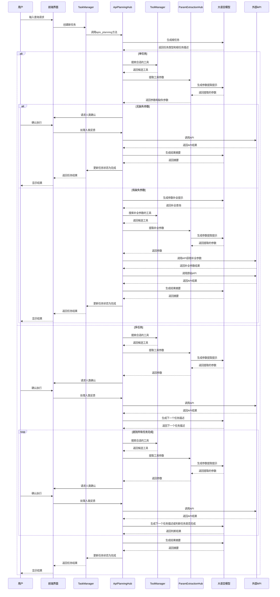

# Agent-Copilot-HITL 项目分析报告

## 1. 项目概述

Agent-Copilot-HITL 是一个基于大语言模型的智能代理系统，具有人类干预能力（Human-In-The-Loop, HITL）。该系统能够理解用户需求，自动规划任务，选择合适的工具（API），提取参数，并在需要时请求人类确认，最终完成复杂的任务。

### 技术栈
- **前端**：React
- **后端**：FastAPI
- **数据库**：MongoDB（任务、工具、会话存储）、Redis（缓存）、Milvus（向量检索）
- **大语言模型**：支持多种LLM，如通义千问等

### 核心功能
- 任务规划与分解
- 工具（API）选择与调用
- 参数自动提取与补全
- 人类反馈处理
- 任务执行状态管理
- 会话历史管理

## 2. 核心组件分析

### 2.1 TaskManager（任务管理器）
**文件路径**：`tasks/task_manager.py`

任务管理器负责任务的生命周期管理，包括任务的创建、更新、查询和迁移。

主要功能：
- 创建新任务
- 更新任务状态和信息
- 查询特定任务
- 获取用户任务历史
- 迁移旧任务到会话库

核心方法：
- `create_task()`：创建新任务
- `update_task_recorder()`：更新任务信息
- `get_task_by_id()`：根据ID获取任务
- `migrate_old_tasks_to_session()`：将超过指定天数的任务迁移到session库

### 2.2 ToolManager（工具管理器）
**文件路径**：`tools/tool_manager.py`

工具管理器负责工具的管理、上传和搜索，支持向量检索和重排序。

主要功能：
- 工具的增删改查
- 从JSON文件导入工具定义
- 使用Milvus进行向量检索
- 使用重排序模型优化搜索结果

核心方法：
- `upload_file()`：从JSON文件导入工具
- `search_tools_with_rerank()`：使用向量检索和重排序搜索工具
- `get_tools_by_ids()`：根据ID获取工具

### 2.3 ApiPlanningHub（API规划中心）
**文件路径**：`apis/api_planning_hub.py`

API规划中心是系统的核心组件，负责将用户需求转化为具体的API调用计划。

主要功能：
- 任务类型判断（单任务/多任务）
- API选择与参数提取
- 缺失参数补全
- 人类反馈处理
- 工具调用与结果处理

核心方法：
- `apis_planning()`：多API规划
- `api_planning_before_human_feedback()`：执行前的人类确认
- `api_planning_handle_human_feedback()`：处理人类反馈
- `_process_single_api_invoke()`：执行单个API调用

### 2.4 ParamExtractionHub（参数提取中心）
**文件路径**：`param_extraction/param_extraction_hub.py`

参数提取中心负责从用户查询中提取工具所需的参数。

主要功能：
- 使用LLM提取参数
- 验证参数类型和完整性
- 处理缺失参数

核心方法：
- `extraction_params()`：从查询中提取参数
- `validate_params()`：验证参数的完整性和类型

### 2.5 GenerateTaskHub（任务生成中心）
**文件路径**：`tasks/generate_task_hub.py`

任务生成中心负责将用户的自然语言查询转换为结构化的任务描述。

主要功能：
- 根任务生成
- 参数任务生成
- 子任务生成
- 任务状态判断

核心方法：
- `gen_root_task()`：生成根任务
- `gen_param_task()`：生成参数任务
- `gen_task_from_context()`：从上下文生成任务

## 3. Agent相关知识应用

### 3.1 任务规划（Task Planning）
**实现位置**：`apis/api_planning_hub.py`

系统能够将复杂用户需求分解为多个子任务，并确定执行顺序。

核心实现：
```python
def apis_planning(self, query, task_id):
    is_single_task, root_task_description = self.generate_task_hub.gen_root_task(query)
    if is_single_task:
        # 单任务处理
        self.api_planning_before_human_feedback(query, task_id, query)
    else:
        # 多任务处理
        self.api_planning_before_human_feedback(root_task_description, task_id, query)
```

### 3.2 工具选择（Tool Selection）
**实现位置**：`tools/tool_manager.py` 和 `apis/api_selection_hub.py`

系统使用向量检索和重排序技术从工具库中选择最适合当前任务的工具。

核心实现：
```python
def search_tools_with_rerank(self, query, top_k=20, final_top_n=5):
    # 向量检索获取候选工具ID
    candidate_tool_ids = self.milvus.get_docs("tools", query, topk=top_k)
    # 获取候选工具详细信息
    candidate_tools = self.get_tools_by_ids(candidate_tool_ids)
    # 重排序
    reranked_indices = self.reranker.rerank(query, candidates_for_rerank)
    # 返回最终结果
    return final_tools[:final_top_n]
```

### 3.3 参数提取与补全（Parameter Extraction & Completion）
**实现位置**：`param_extraction/param_extraction_hub.py`

系统能够从用户查询中自动提取工具所需的参数，并在参数缺失时尝试补全。

核心实现：
```python
def extraction_params(self, query, tool: Tool):
    prompt = self.PromptModelHub.gen_get_all_parameters_prompt(query, request_body)
    model_output = self.LargeLanguageModel.chat_completions(prompt, self.model, self.temperature, self.top_p)
    results = self.PromptModelHub.post_process_get_all_parameter_result(model_output, tool)
    missing_param = self.validate_params(tool, results)
    return results, missing_param
```

### 3.4 人类干预（Human-In-The-Loop）
**实现位置**：`apis/api_planning_hub.py`

系统在执行关键操作前会请求人类确认，提高系统安全性和可靠性。

核心实现：
```python
def api_planning_handle_human_feedback(self, task, human_feedback):
    # 识别人类反馈意图
    intent = self._recognize_human_intent(human_feedback, tool, curr_tool_param)
    
    if intent == "confirm":
        # 执行工具调用
        invoke_result = self._process_single_api_invoke(task.raw_query, task, tool, curr_tool_param)
        # 更新任务状态
    elif intent == "abort":
        # 放弃任务执行
    else:
        # 请求明确反馈
```

### 3.5 会话管理（Session Management）
**实现位置**：`tasks/task_manager.py` 和 `entity/session_entity.py`

系统支持会话历史管理，包括会话的创建、查询和迁移。

核心实现：
```python
def get_user_history(self, user_id: str, limit: int = 100, days: int = 7) -> list:
    # 获取最近7天的任务
    recent_tasks = self.get_user_tasks(user_id, limit=limit, days=min(days, 7))
    
    # 如果需要获取超过7天的记录，从session库中获取
    if days > 7:
        older_sessions = self.get_user_sessions(user_id, 
                                               limit=limit - len(recent_tasks), 
                                               days=days - 7)
        return recent_tasks + older_sessions
    else:
        return recent_tasks
```

## 4. 工作流程时序图



## 5. 关键技术点

### 5.1 LLM 集成与应用
- **意图识别**：使用LLM分析用户查询意图，生成任务描述
- **参数提取**：通过提示工程引导LLM从自然语言中提取结构化参数
- **任务规划**：利用LLM的推理能力分解复杂任务
- **结果总结**：使用LLM生成简洁的任务执行结果摘要

### 5.2 向量检索与重排序
- 使用Milvus向量数据库存储工具描述的向量表示
- 基于语义相似度进行工具检索
- 应用重排序模型（如通义千问重排序模型）优化检索结果

### 5.3 任务状态管理
- 使用状态机管理任务的生命周期
- 支持任务的中断、恢复和重新执行
- 提供可视化的任务执行流程展示

### 5.4 人类干预机制
- 在关键决策点请求人类确认
- 支持任务的手动中止
- 提供清晰的反馈渠道

### 5.5 会话历史管理
- 支持会话的持久化存储
- 自动迁移旧会话到归档库
- 提供用户会话历史查询接口

### 5.6 安全机制
- 提示注入检测与防护
- 参数验证与类型转换
- 循环调用检测与防止

## 6. 总结

Agent-Copilot-HITL 项目是一个功能完整、架构清晰的智能代理系统，融合了大语言模型、向量检索、任务规划等先进技术，并通过人类干预机制提高了系统的安全性和可靠性。

该系统的核心价值在于能够将复杂的用户需求自动转化为一系列API调用，减少了人工操作的复杂性，同时通过人类干预机制保证了系统的可控性。系统的模块化设计使得各个组件可以独立演进和优化，具有良好的扩展性和维护性。

未来可以进一步优化的方向包括：
- 提高参数提取的准确性
- 增强工具选择的智能性
- 优化人类干预的时机和方式
- 支持更多类型的工具和数据源
- 提高系统的并发处理能力
